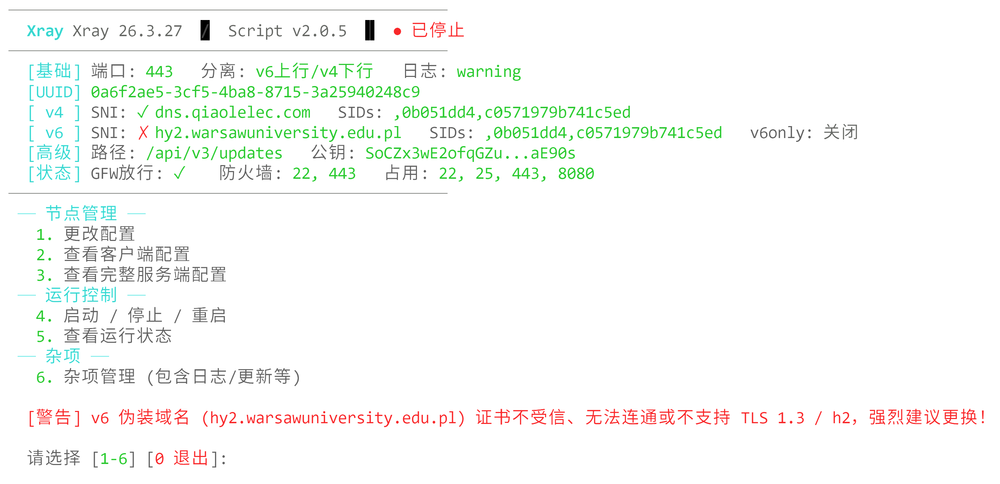

# XHTTP 双栈上下行分离一键安装管理脚本

本项目是一款专为双栈（IPv4/IPv6）回国路线优秀的服务器设计的 Xray 一键安装管理脚本。基于**VLESS-REALITY + XHTTP** 架构，支持 **IPv4/IPv6 上下行分流**来最大化伪装。（基于上游bash模板，大改了所有内容）



## 🚀 核心配置特点

1. 🌐 双栈上下行物理分离：上传流量和下载流量路由到服务器的两个不同 IP 栈（如：IPv4 上行，IPv6 下行），且不同栈拥有截然不同的伪装参数。

2. 🛡️ 顶配 XHTTP 伪装与混淆：设置了多项深度的 `xhttp` 高级混淆与性能优化参数：`x-padding-bytes`、`x-padding-placement`、`x-padding-method`、`x-padding-key`、`x-padding-header`、`x-padding-obfs-mode`、`session/seq-placement`、`no-grpc-header`、`no-sse-header`、`uplink-http-method`、`sc-stream-up-server-secs`、`server-max-header-bytes`、`max-concurrency`、`h-max-request-times`、`h-max-reusable-secs`，以及双栈套接字层面的 `packet-encoding: xudp`、`tcp-fast-open` (TFO) 与 `tcp-mptcp` (MPTCP)。配合上行模拟 `chrome` 指纹，下行模拟 `firefox` 指纹。

3. 🔒 REALITY 安全性
    - Vision 流控：入站支持 `xtls-rprx-vision`
    - 端口回落：检测 443 端口被占用时，回落至 8443 端口，拒绝非标端口。

## 🛠️ 脚本功能大纲

- 自动加速优化：一键开启内核 BBR 拥塞控制、TCP Fast Open (TFO) 与 Multipath TCP (MPTCP)。自动集成 Happy Eyeballs (UseIPv4v6) 机制实现双栈自动优选与平滑回退。
- 安全探针：
  - 自动探测当前服务器 IP 的 GFW 连通性状态。
  - SNI 安全自检：校验伪装域名的证书及 TLS 1.3, h2等。在面板提供 `✓` 或 `✗` 的可视化标记与预警提醒。
- 安全策略：内置防火墙配置，屏蔽 BitTorrent (BT) 下载、阻断回国流量与Private IP段。
- 配置交互：
  - 支持更改端口（仅支持 443/8443）、路径、UUID、密钥对、各栈 SNI 伪装域名与 ShortIds。
  - 支持一键切换双栈分离方向（v4上行/v6下行 或 v6上行/v4下行）。
  - 支持选择 XHTTP 双栈分离或仅 Vision Reality 部署模式，输出对应的 Mihomo YAML 或 VLESS 分享链接。
- 运维支持：
  - 合并双端配置文件，提供服务端 JSON 配置预览。
  - 支持查看综合日志（混合输出 access.log 与 error.log）、修改日志等级、一键测试运行。
  - 防火墙双栈端口一键统管（放行/关闭）、核心及脚本的在线升级。

## ⚡ 快速开始

### 安装命令
```bash
bash <(wget -qO- -o- https://github.com/Chen017/Xray/raw/main/install.sh)
```
> **提示**：初次安装需输入伪装的 v4/v6 域名（可使用脚本提供的默认列表）并选择双栈上下行分离模式。

### 管理菜单
安装完成后，可在终端执行 `xray` 命令进入交互式主菜单。
