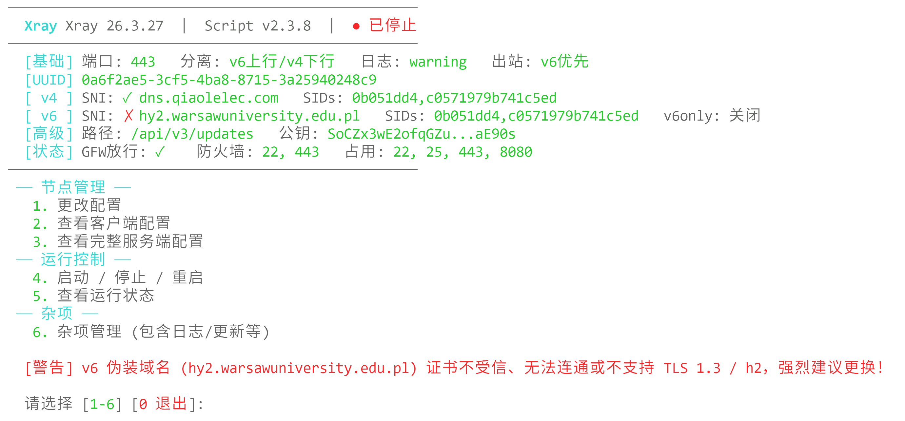

# XHTTP 双栈上下行分离一键安装管理脚本

本项目是一款专为双栈（IPv4/IPv6）回国路线优秀的服务器设计的 Xray 一键安装管理脚本。基于**VLESS-REALITY + XHTTP** 架构，支持 **IPv4/IPv6 上下行分流**来最大化伪装。（基于上游bash模板，大改了所有内容）



## 🚀 核心配置特点

1. 🌐 双栈上下行物理分离：上传流量和下载流量路由到服务器的两个不同 IP 栈（如：IPv4 上行，IPv6 下行），且不同栈拥有截然不同的伪装参数。

2. 🛡️ 顶配 XHTTP 伪装与混淆：设置了多项深度的 `xhttp` 高级混淆与性能优化参数：`x-padding-bytes`、`x-padding-placement`、`x-padding-method`、`x-padding-key`、`x-padding-header`、`x-padding-obfs-mode`、`session/seq-placement`、`no-grpc-header`、`no-sse-header`、`uplink-http-method`、`sc-stream-up-server-secs`、`server-max-header-bytes`、`max-concurrency`、`h-max-request-times`、`h-max-reusable-secs`，以及客户端侧的 `packet-encoding: xudp`、`tcp-fast-open` (TFO) 与 `tcp-mptcp` (MPTCP)。服务端限制与客户端复用参数分别生成。配合上行模拟 `chrome` 指纹，下行模拟 `firefox` 指纹。

3. 🔒 REALITY 安全性
    - Vision 流控：入站支持 `xtls-rprx-vision`
    - 端口回落：检测 443 端口被占用时，回落至 8443 端口，拒绝非标端口。

## 🛠️ 脚本功能大纲

- 自动加速优化：内核支持时启用 BBR；TFO 与 MPTCP 的效果取决于内核、网络和客户端。支持选择真正的 Happy Eyeballs 双栈 TCP 连接竞速（需 Xray v25.6.8+）；`UseIPv4v6` 仅表示解析优先，不等于连接失败回退。
- 安全探针：
  - 按需检查服务器访问国内测试节点的出站连通性；结果不能证明国内客户端到本机是否被阻断。
  - SNI 安全自检：按需校验伪装域名的证书、TLS 1.3 与 h2，结果缓存五分钟，可手动刷新；首页只读取本地状态。
  - CDN 检测：按需查询伪装域名 IP 的 ASN 归属并提示疑似 CDN；DNS 查询失败会报告无法判断，多地址解析不会直接认定为 CDN。
- 安全策略与分流：使用独立防火墙链，保留系统与其他应用规则；屏蔽 BitTorrent (BT) 下载、阻断回国流量与 Private IP 段。支持自定义分流规则管理（支持在阻断回国流量之前插入自定义规则，如放行 `geosite:cn` 内部的 `DOMAIN-SUFFIX,kimi.ai`）。
- 配置交互：
  - 支持更改端口（仅支持 443/8443）、路径、UUID、密钥对、各栈 SNI 伪装域名与 ShortIds。
  - 支持增加、编辑、删除与排序自定义分流规则（支持 `DOMAIN`、`DOMAIN-SUFFIX`、`DOMAIN-KEYWORD`、`IP-CIDR`、`GEOSITE`、`GEOIP`，动作支持放行 `direct`、IPv4 解析 `direct-v4`、IPv6 解析 `direct-v6` 与阻止 `block`）。
  - 支持一键切换双栈分离方向（v4上行/v6下行 或 v6上行/v4下行）。
  - 支持切换出站 IP 策略（IPv4 / IPv6 解析、双栈解析优先 / 双栈连接竞速），适配不同双栈或纯 IPv6 机器需求。
  - 支持选择 XHTTP 双栈分离、单栈 XHTTP 或 Vision Reality 客户端连接方案，输出对应的 Mihomo YAML 或 VLESS 分享链接。
- 🔗 线路 / 落地互联：支持将优质线路 VPS 与落地 VPS 互联，采用内部专用的 VLESS RAW + Vision + VLESS 加密传输。
  - **线路机**：`客户端 → 线路机 → 落地机 → Internet`；**落地机**也可作为独立普通节点使用。
  - **创建与导入**：先在落地机进入 `4. 线路 / 落地互联`，输入线路机 IPv4 并生成中继链接，再在线路机进入相同菜单导入链接。
  - **客户端导出**：在线路机进入 `2. 查看客户端配置`，选择 `经落地`；客户端连接地址仍为线路机。
- 运维支持：
  - 合并双端配置文件，提供服务端 JSON 配置预览。
  - 支持查看综合日志（混合输出 access.log 与 error.log）、修改日志等级、配置校验（与启动服务分开）。
  - 防火墙双栈端口管理（放行/关闭）、核心及脚本的在线升级。
  - 配置先校验再应用，失败自动回滚；更新校验下载内容并保留上一版本，内容未变化时不重启。脚本更新保留额外的用户文件与外部补丁模块。
  - geodata 每日通过 systemd 定时更新，校验失败保留旧数据；日志自动轮转，退出时清理临时文件与跟踪进程。

## ⚙️ 兼容性

- 支持系统：Ubuntu / Debian / CentOS
- 架构：x86_64 / arm64
- Xray 版本：跟随 [XTLS/Xray-core](https://github.com/XTLS/Xray-core) 最新 Release 自动拉取

## ⚡ 快速开始

### 安装命令
```bash
bash <(wget -qO- -o- https://github.com/Chen017/Xray/raw/main/install.sh)
```
> **提示**：初次安装需输入伪装的 v4/v6 域名（可使用脚本提供的默认列表）并选择双栈上下行分离模式。

### 管理菜单
安装完成后，可在终端执行 `xray` 命令进入交互式主菜单。保留节点管理、运行控制、杂项的原有菜单排布。
